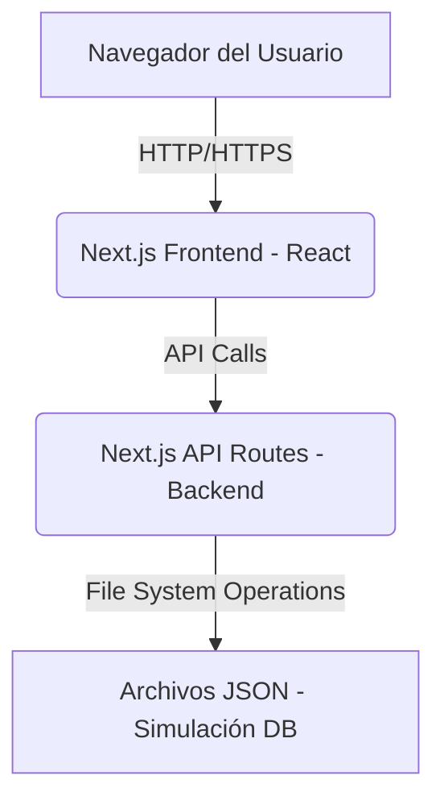

# Documentación Técnica - Aplicación de Gestión de Turnos

Este documento detalla la arquitectura, las tecnologías utilizadas y la estructura del código de la aplicación "Gestor de Turnos". Está dirigido a desarrolladores que deseen entender, mantener o extender la aplicación.

## 1. Arquitectura General

La aplicación sigue una arquitectura de Single Page Application (SPA) con un enfoque de frontend y backend integrados utilizando Next.js. El frontend es una aplicación React que se ejecuta en el navegador, mientras que el backend se implementa mediante las API Routes de Next.js, que se ejecutan en el servidor. La persistencia de datos se simula actualmente utilizando archivos JSON en el servidor.



## 2. Tecnologías Utilizadas

*   **Framework Frontend/Backend:** Next.js (React Framework)
    *   **React:** Biblioteca JavaScript para construir interfaces de usuario.
    *   **TypeScript:** Superset de JavaScript que añade tipado estático.
*   **Estilos:** Bootstrap 5 (CSS Framework)
*   **Gestión de Estado (Frontend):** React Hooks (`useState`, `useEffect`, `useMemo`, `useCallback`, `useContext`)
*   **Calendario Interactivo:** FullCalendar (`@fullcalendar/react`, `@fullcalendar/daygrid`, `@fullcalendar/timegrid`, `@fullcalendar/interaction`, `@fullcalendar/bootstrap5`)
*   **Persistencia de Datos (Simulada):** Sistema de archivos (Node.js `fs` y `path`) para leer/escribir archivos JSON.
*   **Herramientas de Desarrollo:** ESLint (para linting de código), npm (gestor de paquetes).

## 3. Estructura de Directorios

```
turnos-app/
├── app/                  # Contiene los componentes de la aplicación Next.js (App Router)
│   ├── components/       # Componentes reutilizables de React
│   │   ├── Calendar.tsx
│   │   ├── ClientLayoutWrapper.tsx
│   │   ├── ClienteForm.tsx
│   │   ├── EmpleadoForm.tsx
│   │   ├── Navbar.tsx
│   │   ├── Notification.tsx
│   │   ├── NotificationContext.tsx
│   │   ├── ServicioForm.tsx
│   │   └── TurnoForm.tsx
│   ├── data/             # Datos de ejemplo y lógica de persistencia en archivos JSON
│   │   ├── clientes.json
│   │   ├── empleados.json
│   │   ├── servicios.json
│   │   ├── turnos.json
│   │   └── db.ts         # Funciones para leer/escribir datos JSON
│   ├── models/           # Definiciones de interfaces TypeScript para los modelos de datos
│   │   ├── Cliente.ts
│   │   ├── Empleado.ts
│   │   ├── Servicio.ts
│   │   └── Turno.ts
│   ├── clientes/         # Página de gestión de clientes
│   │   └── page.tsx
│   ├── comisiones/       # Página de cálculo de comisiones
│   │   └── page.tsx
│   ├── empleados/        # Página de gestión de empleados
│   │   └── page.tsx
│   ├── servicios/        # Página de gestión de servicios
│   │   └── page.tsx
│   ├── turnos/           # Página de gestión de turnos (con calendario)
│   │   └── page.tsx
│   ├── favicon.ico
│   ├── globals.css
│   ├── layout.tsx        # Layout principal de la aplicación (Server Component)
│   └── page.tsx          # Página de inicio (Server Component)
├── pages/                # Contiene las API Routes de Next.js (Pages Router)
│   └── api/              # Endpoints de la API RESTful
│       ├── clientes.ts
│       ├── empleados.ts
│       ├── servicios.ts
│       └── turnos.ts
├── public/               # Archivos estáticos (imágenes, etc.)
├── .eslintrc.json        # Configuración de ESLint
├── next-env.d.ts
├── next.config.ts
├── package-lock.json
├── package.json
├── README.md
├── ROADMAP.md            # Documento de hoja de ruta del proyecto
├── tsconfig.json
└── ... (otros archivos de configuración y build)
```

## 4. Componentes Clave y su Lógica

### 4.1. Modelos (`app/models/*.ts`)

Definen las interfaces TypeScript para las estructuras de datos utilizadas en la aplicación (`Cliente`, `Servicio`, `Empleado`, `Turno`). Esto asegura el tipado estático y la consistencia de los datos.

### 4.2. Simulación de Base de Datos (`app/data/db.ts`)

*   Proporciona funciones (`getClientes`, `saveClientes`, etc.) para interactuar con los archivos JSON que actúan como nuestra base de datos simulada.
*   Utiliza los módulos `fs` y `path` de Node.js para leer y escribir en el sistema de archivos.

### 4.3. API Routes (`pages/api/*.ts`)

*   Implementan los endpoints RESTful para las operaciones CRUD de cada entidad.
*   Cada archivo (`clientes.ts`, `servicios.ts`, `empleados.ts`, `turnos.ts`) maneja las solicitudes HTTP (GET, POST, PUT, DELETE) para su respectiva entidad.
*   Interactúan con `app/data/db.ts` para la persistencia de datos.

### 4.4. Componentes de Formulario (`app/components/*Form.tsx`)

*   (`ClienteForm`, `ServicioForm`, `EmpleadoForm`, `TurnoForm`)
*   Componentes de React que gestionan el estado local de los formularios.
*   Utilizan `useState` para los campos de entrada y `useEffect` para inicializar los valores al editar una entidad existente.
*   Manejan el envío del formulario (`handleSubmit`) y la cancelación (`onCancel`).
*   `TurnoForm` incluye lógica de validación para evitar la superposición de turnos y asegurar que los turnos estén dentro del horario laboral del empleado.

### 4.5. Páginas (`app/*/page.tsx`)

*   Componentes de React que representan las diferentes vistas de la aplicación.
*   Son componentes de cliente (`'use client'`) para permitir el uso de hooks de React y la interacción con el navegador.
*   Utilizan `useState` para gestionar el estado de las listas de entidades y los formularios.
*   Utilizan `useEffect` para cargar los datos iniciales desde las API Routes.
*   Implementan funciones asíncronas (`fetchData`, `handleSave`, `handleDelete`) para interactuar con las API Routes.
*   `TurnosPage` integra el componente `Calendar` para la visualización interactiva de turnos y contiene la lógica de búsqueda y filtrado.

### 4.6. Componente de Calendario (`app/components/Calendar.tsx`)

*   Encapsula la lógica y la UI del calendario interactivo utilizando la biblioteca FullCalendar.
*   Recibe los turnos como `props` y los mapea a un formato de eventos compatible con FullCalendar.
*   Maneja los eventos de clic en fechas (`onDateClick`) y en eventos (`onEventClick`) para permitir la creación y edición de turnos directamente desde el calendario.

### 4.7. Sistema de Notificaciones (`app/components/Notification.tsx`, `app/components/NotificationContext.tsx`)

*   **`Notification.tsx`:** Componente UI para mostrar mensajes emergentes (toasts) de éxito, error, etc.
*   **`NotificationContext.tsx`:** Utiliza React Context para proporcionar una forma global de mostrar notificaciones desde cualquier componente de la aplicación a través del hook `useNotification`.

### 4.8. Layout Principal (`app/layout.tsx`, `app/components/ClientLayoutWrapper.tsx`)

*   **`app/layout.tsx`:** Componente de servidor que define la estructura HTML básica y los metadatos de la aplicación. Importa `ClientLayoutWrapper`.
*   **`app/components/ClientLayoutWrapper.tsx`:** Componente de cliente que envuelve el contenido principal de la aplicación. Contiene la `NotificationProvider` y la `Navbar`, asegurando que los hooks de React se utilicen en el entorno de cliente correcto.

## 5. Flujo de Datos (Ejemplo: Guardar un Cliente)

1.  El usuario interactúa con `ClienteForm.tsx` en `app/clientes/page.tsx`.
2.  Al enviar el formulario, `handleSaveCliente` en `app/clientes/page.tsx` se invoca.
3.  `handleSaveCliente` realiza una solicitud `POST` o `PUT` a `/api/clientes` utilizando `fetch`.
4.  La API Route `pages/api/clientes.ts` recibe la solicitud.
5.  `pages/api/clientes.ts` utiliza el cliente de Prisma (`prisma.cliente.create` o `prisma.cliente.update`) para interactuar con la base de datos SQLite.
6.  La API Route responde con el estado HTTP apropiado.
7.  `handleSaveCliente` en el frontend recibe la respuesta, muestra una notificación de éxito/error usando `useNotification`, y vuelve a cargar la lista de clientes (`fetchClientes`) para reflejar los cambios.

## 6. Consideraciones de Despliegue y Persistencia de Datos

La aplicación utiliza **SQLite** como base de datos, que es una base de datos basada en archivos. Esto es ideal para el desarrollo local y aplicaciones de escritorio, pero **no es adecuada para despliegues en entornos serverless o sin estado como Netlify, Vercel, o Render** si la base de datos se almacena directamente en el sistema de archivos del servidor. Esto se debe a que estos entornos no garantizan la persistencia de los archivos entre despliegues o instancias de la aplicación.

Para desplegar una aplicación Next.js con una base de datos persistente en un entorno de producción, se recomiendan las siguientes opciones:

*   **Bases de Datos Gestionadas (Recomendado para Next.js en Serverless):**
    *   **PostgreSQL (o MySQL):** Utilizar servicios de bases de datos gestionadas que ofrecen planes gratuitos o de bajo costo para proyectos pequeños. Ejemplos populares incluyen Supabase, Neon, Render, Railway, ElephantSQL, PlanetScale (MySQL).
    *   **MongoDB:** Si se prefiere una base de datos NoSQL, MongoDB Atlas ofrece un clúster gratuito.
    *   **Funcionamiento:** La aplicación Next.js (desplegada en Netlify, Vercel, etc.) se conectaría a esta base de datos externa a través de una URL de conexión (almacenada como una variable de entorno). Prisma es compatible con todas estas bases de datos.

*   **Plataformas de Despliegue Full-Stack:**
    *   **Vercel:** Plataforma creada por los desarrolladores de Next.js. Ofrece una integración excelente y optimizaciones. Se puede conectar fácilmente a bases de datos gestionadas externas.
    *   **Render / Railway:** Plataformas que permiten desplegar tanto el frontend (Next.js) como los servicios de backend (incluyendo bases de datos) en un solo lugar, simplificando la configuración.

**Recomendación:** Para un despliegue gratuito y fácil con Next.js, se sugiere usar **Vercel** para el frontend y conectar una base de datos **PostgreSQL gestionada** (como Supabase o Neon) o **MongoDB Atlas** para la base de datos.

## 7. Consideraciones Futuras

*   **Manejo de Errores:** Se ha implementado un manejo básico de errores con notificaciones, pero se podría mejorar con logging más robusto y mensajes de error más específicos para el usuario.
*   **Escalabilidad:** La arquitectura actual es adecuada para una aplicación pequeña. Para una mayor escalabilidad, se considerarían patrones de diseño más avanzados y una infraestructura de backend más robusta.
*   **Integraciones:**
    *   **Sistemas de Pago:** La integración con pasarelas de pago (ej. Stripe, Mercado Pago) implicaría:
        *   Configuración de cuentas de desarrollador y obtención de claves API.
        *   Implementación de flujos de pago seguros (ej. Checkout de Stripe, SDKs de pasarelas).
        *   Manejo de webhooks para confirmar pagos y actualizar el estado de los turnos.
        *   Consideraciones de seguridad y cumplimiento (PCI DSS).
    *   **Calendarios Externos (Google Calendar, Outlook Calendar):** La integración con calendarios externos permitiría:
        *   Sincronización bidireccional de turnos (crear/actualizar turnos en la app y en el calendario externo).
        *   Uso de OAuth 2.0 para la autenticación y autorización de acceso a los calendarios de los usuarios.
        *   Manejo de APIs de calendario (Google Calendar API, Microsoft Graph API).
        *   Consideraciones sobre límites de API y manejo de errores de sincronización.
